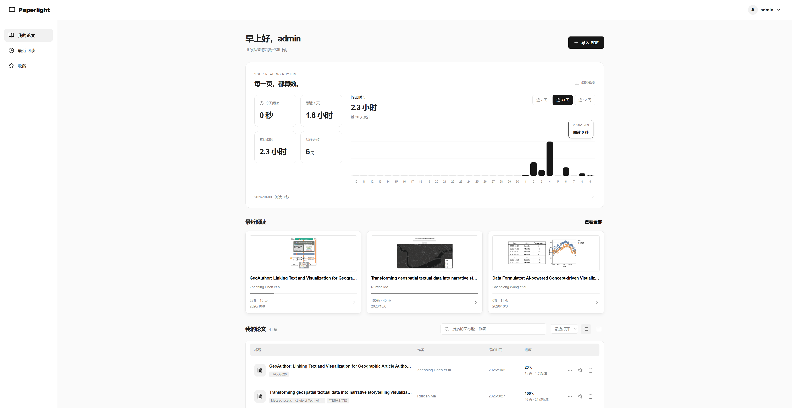
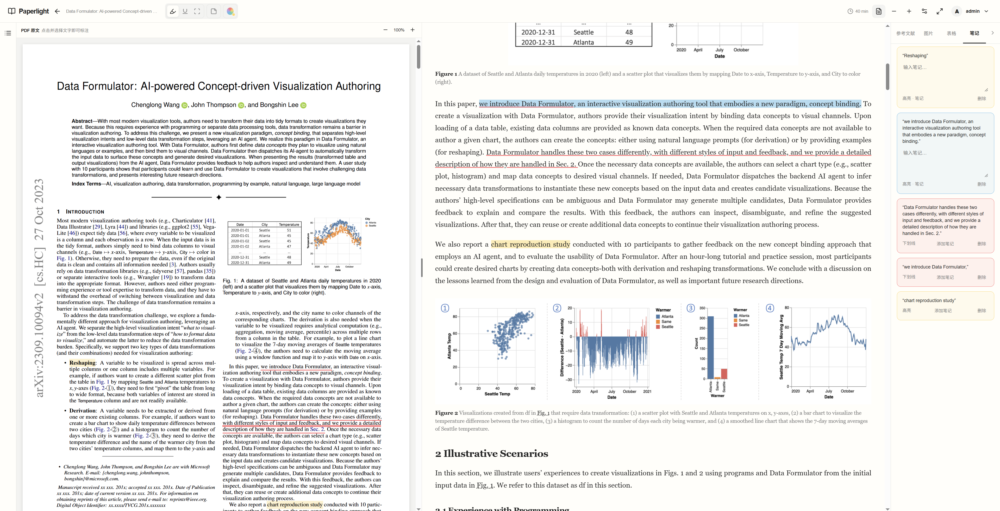
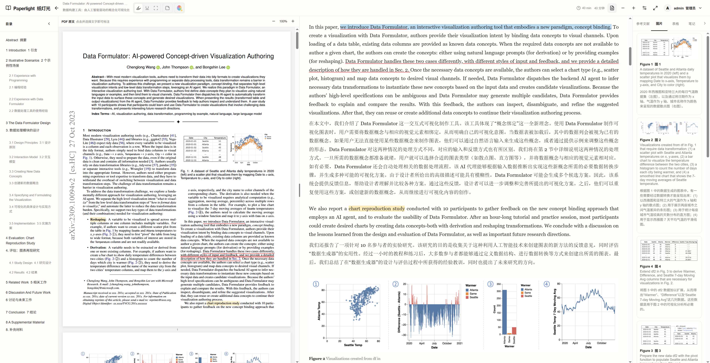
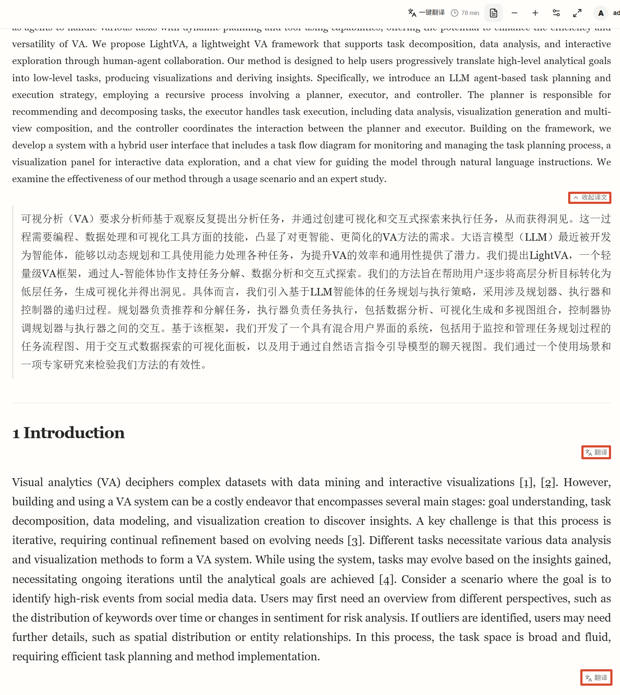

# Paperlight · 让阅读，慢下来

Paperlight 是一个可以自己部署的论文阅读工作台。它把 PDF 转成适合连续阅读的 HTML 正文，让你通过内置 DeepSeek 翻译或自己喜欢的网页翻译插件，按「一段英文、一段中文」的方式阅读论文：先借助译文快速理解，再就近找到对应的英文原句。同时，章节、图表、参考文献和笔记集中在同一个界面，原始 PDF 也保留供随时对照。

你可以在自己的电脑或服务器上运行它，用浏览器管理论文、标注重点、记录想法，再从上次的位置继续阅读。PDF 结构解析在部署主机上用 CPU 完成，无需购买显卡；DeepSeek API 用于段落翻译、补齐发表信息和公式辅助转写，是本 README 完整部署流程的必备配置。你可以使用内置段落翻译，也可以选择自己喜欢的网页翻译插件；远程访问可以按需启用。

[界面预览](#界面预览) · [功能介绍](#功能介绍) · [双语阅读](#双语阅读) · [内置翻译](#内置-deepseek-翻译) · [部署方法](#部署方法) · [DeepSeek 配置](#deepseek-api-配置必备) · [可选远程访问](#可选远程访问) · [模型与运行成本](docs/deployment.md)

## 为什么做 Paperlight

做这个工具的初衷，是 PDF 翻译之后很难方便地对照原文。读到一句译文有疑问时，往往还要回到原 PDF，在双栏排版或跨页内容中寻找对应的英文句子，阅读节奏很容易被打断。

我更习惯网页端「一段英文、一段中文」的阅读方式：译文帮助我快速理解，英文原文就在附近，可以马上确认某句话原本是怎么说的、术语用的是什么，也更方便定位想要引用或标注的原句。

Paperlight 的思路因此很直接：**将 PDF 转成 HTML，再使用自己喜欢的网页翻译插件进行双语翻译。** 把固定版式的论文变成按段落连续阅读的网页，让翻译插件处理语言，让阅读器负责目录、图表、原文对照和笔记，从而更顺畅地完成快速阅读与重点精读。

为了让这种阅读方式也能直接在工具内完成，Paperlight 增加了 DeepSeek 段落翻译：需要时翻译某一段，或一键翻译所有标题和文本段落，译文紧接原文显示并保存。你仍然可以继续使用自己熟悉的翻译插件。

在这个基础上，论文库、收藏、阅读进度和标注把阅读记录保存下来，方便之后继续阅读或回看。结构化解析会受 PDF 的质量和版式影响，原始 PDF 始终保留，方便核对公式、图片与解析结果。

## 适合哪些用户

- **研究生、博士生和科研工作者**：需要长期积累论文、精读文献，并把阅读进度和笔记保留下来。
- **做技术调研的工程师与研究人员**：需要围绕一个方向反复阅读多篇论文，快速找到读过的文献、图表和重点。
- **希望中英对照阅读论文的学生、自学者和研究人员**：习惯借助翻译快速理解，又希望随时确认译文对应的英文原句。
- **愿意自建阅读服务的个人或小型课题组**：可以在一台主机上部署，给不同用户提供独立论文库，由管理员管理账号。

普通用户主要通过浏览器使用；部署者需要能够安装 Docker，并在终端执行启动和初始化命令。开启远程访问后，同一用户在不同设备上登录同一个部署实例，可以继续使用服务器保存的论文、进度、笔记和阅读设置。

## 界面预览

### 首页与登录

首页使用本地 3D 书本模型，支持拖动旋转、滚轮缩放与右键还原。右侧提供登录和注册入口；注册只需用户名、密码和确认密码。


### 论文库与阅读统计

论文库集中展示最近阅读、收藏、论文进度和阅读时长。可以搜索标题或作者，切换列表与卡片视图，从上次打开的论文继续阅读。



### 阅读器与原文对照

阅读器默认展示网页正文；打开 PDF 后，可以并排查看原文和结构化正文，调整两栏宽度，并在侧栏查看图表、参考文献和笔记。下图展示了原 PDF、正文标注和笔记一起使用的状态。



以上截图位于仓库根目录的 `fig/`，展示的是实际运行界面。

## 双语阅读

两种方式都围绕同一个阅读习惯：保留英文原文，让中文译文紧接对应段落，遇到有疑问的句子就能就近核对。内置翻译直接使用部署时配置的 DeepSeek API，并将译文保存到服务器；网页翻译插件则可以继续使用你喜欢的翻译服务。

### 用自己喜欢的翻译插件进行双语阅读

Paperlight 将论文正文呈现为 HTML，提供网页翻译插件可以处理的段落。你可以继续使用自己熟悉的插件；选择支持保留原文、显示双语译文的模式，就能按英文段落与中文译文交替阅读，无需单独寻找另一个翻译版 PDF。

1. 导入 PDF，等待解析完成，进入论文阅读器。
2. 启用自己喜欢的网页翻译插件，将目标语言设为中文。
3. 选择插件提供的「双语对照」「保留原文」或类似模式。具体名称和可用效果取决于所选插件。
4. 先读译文把握内容；遇到有疑问的句子，直接查看邻近英文段落，确认原句和术语。需要核对公式、图片或排版时，再打开左侧原 PDF。

下图展示了实际翻译后的阅读状态：中间正文保留英文，并在对应段落后显示中文；左侧仍可对照原 PDF，目录与图注也呈现了双语内容。



例如，看到中文里的「概念绑定」时，可以直接在相邻英文段落中找到 `concept binding`，继续确认它在原句中的含义。译文与原文靠近，既方便快速理解，也方便回到原句精读。

上述方式由浏览器插件及其翻译服务提供。Paperlight 也支持下面介绍的内置 DeepSeek 段落翻译，两种方式可以按自己的习惯选择。插件支持范围、访问本地 / 私网网页的权限以及翻译费用，取决于你使用的插件；如果本机页面不能翻译，先检查插件是否获准在当前站点运行。双语阅读建议将标注锚定在保留的英文原文上，便于再次定位。

### 内置 DeepSeek 翻译

每个标题、文本段落和图表说明末尾提供「翻译」按钮。点击后后台调用 DeepSeek，将中文译文放在该段原文下方，并保存到服务器；按钮随后变为「收起译文」或「展开译文」。刷新、重新打开论文或换设备登录同一实例，都会加载已保存的译文和展开状态。

顶部「一键翻译」会翻译论文标题、章节标题、全部文本段落以及图片图注和表格说明，逐段展示进度。启动后顶部改为「全部展开」「全部收起」；失败或中断时可用「翻译剩余」继续处理尚未完成的内容，已成功的段落不重复调用。跨页续接的正文按阅读器显示的一整段翻译，原文和已有标注保持原样。

使用方法：

1. 打开已解析完成的论文，在标题或段落末尾点击「翻译」图标；中文译文会出现在对应原文下方。
2. 译文完成后，用同一位置的「收起译文」「展开译文」控制这一段的显示。
3. 想翻译整篇时，点击顶部「一键翻译」。标题和文本段落会陆续完成，顶部显示进度，并提供「全部展开」「全部收起」。
4. 刷新或重新打开论文，继续读取已保存的译文和展开状态；失败的段落可以单独重试，批量任务未完成时可以点击「翻译剩余」。

下图是内置翻译的实际运行示例：上方英文段落的中文译文紧接在原文下，右侧显示「收起译文」；下面尚未翻译的章节标题和正文仍显示「翻译」图标，顶部提供「一键翻译」入口。图中的红框标出了段落控制按钮。



已经执行过一键翻译的论文，更新后可以点击「翻译剩余」补齐新增的图注和表格说明；已保存的正文译文不会重复翻译。

中文译文也可以像英文原文一样选中文字，添加高亮、下划线和笔记。中文标注与原文标注独立保存；刷新后会恢复，从笔记列表跳转时会自动展开相应译文。

一键翻译默认同时处理 **6 个段落请求**，完成一段就显示并保存一段。并行数是同一部署实例共享的上限，不会为每篇论文无限增加请求；遇到限流会按现有重试规则处理。部署者可在根目录 `.env` 调整，支持 1–16，修改后重新创建 parser 容器：

```dotenv
PAPERLIGHT_TRANSLATION_WORKERS=6
```

```sh
docker compose up -d --no-deps --force-recreate parser
```

实际提速取决于段落长度、网络和上游响应速度；调整并行数不会改变译文缓存规则。

段落译文使用已配置的 DeepSeek API，按实际调用计费。逐段按钮只发送该段原文，一键翻译发送全部待翻译的标题和段落；读取缓存、展开或收起不调用模型。暂时中断的任务会显示可重试状态，完成的译文仍保留。

## 功能介绍

| 功能 | 可以做什么 |
| --- | --- |
| 内置段落翻译 | 点击段末按钮用 DeepSeek 翻译，原文下展示并保存译文；支持一键翻译、逐段展开收起和全部展开收起 |
| 网页双语阅读 | 将 PDF 转为 HTML 后，配合自己喜欢的翻译插件显示英文原文与中文译文，就近查找对应原句 |
| PDF 导入与结构化阅读 | 上传 PDF，查看解析状态，将正文按章节和段落阅读；需要时自动识别扫描页面文字 |
| 个人论文库 | 查看所有论文、最近阅读与收藏，按标题或作者搜索，按最近打开、添加时间或标题排序，切换列表 / 卡片视图 |
| 阅读导航 | 使用章节目录定位，在侧栏集中查看图片、表格和参考文献，并从相应条目回到正文 |
| PDF 原文对照 | 按需打开原 PDF，拖动分隔线调整两栏宽度；两栏可独立滚动，也可使用位置同步 |
| 标注与笔记 | 添加高亮、下划线、区域标记和笔记，在论文中保留阅读时的重点与想法 |
| 阅读进度与排版 | 恢复上次阅读位置，调整字体、字号、行距、正文宽度和纸张主题，使用纯正文专注模式（隐藏 PDF、原顶部栏与侧栏，顶部保留独立笔记工具栏）；设置按账号保存 |
| 阅读统计 | 查看今天、最近 7 天、累计阅读时长与阅读天数，以及近 7 天、30 天、12 周的每日时长趋势 |
| 注册与账号管理 | 普通用户自助注册、修改密码；管理员创建、停用、删除账号与重置密码，并可查看和管理用户论文 |
| DeepSeek 辅助信息 | 完整部署需配置 API key，用于段落翻译、查询发表信息与公式辅助转写；查询结果附来源，公式原 PDF 裁图仍保留 |
| 可选远程访问 | 将同一部署实例提供给其他设备，通过账号恢复服务器上的阅读记录 |

进入专注模式后，网页正文占满阅读区域，笔记工具栏独立固定在顶部。高亮、下划线和笔记仍可使用；添加笔记会打开临时编辑框，完成后即可继续阅读。点击工具栏的退出按钮或按 `Esc` 退出；编辑笔记时，第一次 `Esc` 完成笔记，之后再按退出专注模式。退出后恢复原来的 PDF 分栏与侧栏布局。

阅读统计记录实际前台阅读，页面隐藏、失去焦点或长时间无交互时暂停计时。每个普通账号拥有自己的论文与阅读数据；管理员具有管理权限。

## 从导入到阅读，论文经过了什么

1. **上传并保存原 PDF**：论文登记到当前账号的论文库，后台开始解析。
2. **提取结构**：默认使用 Docling 识别页面版面、正文和表格；文字不足时再启用 OCR。
3. **整理阅读顺序与资源**：将解析结果整理成统一文档结构，并结合 PDF 原位置处理段落、图表和公式裁图。
4. **关联参考文献**：优先从 PDF 文本层恢复编号参考文献。默认 `auto` 模式下，提取不足 10 条时才调用 GROBID 辅助处理。
5. **进入阅读器**：按章节展示正文，提供目录、原 PDF 对照和标注工具，阅读记录保存到账号。

行间公式使用原 PDF 裁图；对位置可靠但转写不可靠的行内公式，可能保留原 PDF 段落的视觉呈现。云端公式转写用于辅助复制或修订，阅读时仍能核对原公式。

当前新增导入入口是 **PDF 上传**。旧版从 arXiv HTML 导入的已保存文档仍可阅读，新的 arXiv 链接导入已停用。复杂多栏、特殊图表和扫描件仍可能出现解析误差，需要通过原 PDF 检查。

## 部署方法

### 1. 准备环境

- Windows：安装 Docker Desktop，使用 WSL 2 后端。
- macOS：安装与 Intel / Apple Silicon 芯片对应的 Docker Desktop。
- Linux：安装 Docker Engine 与 Docker Compose 插件。

建议完整部署准备 **16 GB 或以上主机内存、20–30 GB 空闲磁盘**，为 Docker 分配约 **10–12 GiB 内存**。当前使用 CPU 推理。Windows x86 Docker 已完成解析测试；Mac 提供部署路径，但尚未在实机完成端到端测试。Apple Silicon 上 GROBID 通过 x86 模拟运行。

各模型大小、镜像占用、轻量部署方式和测试依据见 [部署与成本说明](docs/deployment.md)。首次构建和模型下载需要网络；下面会先取得源码并配置完整体验所需的 DeepSeek key。

#### 获取项目源码

```sh
git clone https://github.com/qiuqik/paperlight.git
cd paperlight
```

也可以下载仓库 ZIP，解压后在终端进入项目根目录，再完成下面的 API 配置。

#### DeepSeek API 配置（必备）

为获得完整的双语阅读、论文信息和公式使用体验，请在启动前配置 DeepSeek API key。它负责段落翻译、发表信息查询和公式辅助转写；缺少这些信息会降低使用体验，因此本 README 将它列为部署必备项。正文结构仍由本地解析器处理；双语阅读可以使用内置翻译或浏览器插件。DeepSeek 提供三项功能：

- **段落翻译**：按需将标题或文本段落翻译成中文，译文紧接原文显示并保存；一键翻译会处理所有待翻译标题和段落。
- **发表信息查询**：查询论文的发表状态、会议 / 期刊、日期、作者与机构等信息，结果附可核对的来源链接。新导入论文在后台查询，已有论文打开时按需查询，成功结果按文档缓存。
- **公式辅助转写**：将符合条件的公式裁图发送到视觉模型，生成用于复制或修订的 LaTeX；阅读器仍保留原 PDF 裁图。配置后主要对新解析的论文生效，不会自动重解析整个已有论文库。

##### 获取 API key

登录 [DeepSeek 开放平台](https://platform.deepseek.com/)，进入 API Keys 页面创建密钥，并确认账号有可用额度。API key 属于开放平台，不是 DeepSeek 网页聊天账号的登录密码。接口使用方式见 [官方 API 文档](https://api-docs.deepseek.com/)。

##### 配置密钥

打开或新建项目根目录的 `.env` 文件，加入下面这一行，将示例值替换为自己的真实密钥；已有远程地址等配置继续保留：

```dotenv
PAPERLIGHT_DEEPSEEK_API_KEY=sk-your-deepseek-api-key
```

这里指的是与 `docker-compose.yml` 同级的 `.env`。Compose 会把这个变量传给 parser，密钥只供服务端使用，不需要填入网页，也不要放进 `NEXT_PUBLIC_*` 变量。`.env` 已由 Git 忽略，示例值不能直接用于调用。

当前段落翻译、发表信息查询和公式视觉转写默认都使用 `deepseek-flash`。发表查询通过官方 Anthropic 兼容接口调用原生搜索；公式转写通过 Chat Completions 接口发送图片。如果需要调整**发表查询**模型，可在 `backend/.env` 中设置 `PAPERLIGHT_METADATA_MODEL`；这个变量不会改变段落翻译或公式转写模型，也不会从根目录 `.env` 自动传入容器。

旧配置兼容 `backend/.env` 中的 `DEEPSEEK_APIKEY`；两处都有有效 key 时，优先使用根目录传入的 `PAPERLIGHT_DEEPSEEK_API_KEY`。新部署建议统一使用上面的根目录写法。

##### 已部署实例如何更新配置

首次部署完成 `.env` 配置后，继续下一步「启动服务」即可。如果已经部署过，在修改 key 或查询模型后，需要重新创建 parser 容器读取新环境变量，无需重新构建镜像：

```sh
docker compose up -d --no-deps --force-recreate parser
```

使用 Mac 兼容配置时：

```sh
docker compose -f docker-compose.yml -f docker-compose.mac-compat.yml up -d --no-deps --force-recreate parser
```

只执行 `docker compose restart parser` 不会重新加载 `.env`。更换密钥或修改查询模型后，同样需要重新创建容器。

##### 启动服务后确认配置生效

下面的命令仅检查 parser 是否读到了配置，输出布尔值，不显示密钥，也不发起付费 API 请求：

```sh
docker compose exec parser python -c "from app.publication import api_key; from app.vision import configured_provider; p=configured_provider(); print('DeepSeek key configured:', bool(api_key())); print('DeepSeek formula provider selected:', bool(p and p.name == 'deepseek'))"
```

两个值为 `True` 说明配置已被读取，**不代表密钥有效、余额充足或上游调用成功**。实际使用时导入一篇小 PDF，查看后台发表信息查询结果；有公式裁图的论文还可检查辅助转写。请求失败可查看 `docker compose logs --tail 100 parser`，并检查密钥、额度、部署主机网络和模型可用性。Mac 兼容部署的检查命令也需带上相同的两个 `-f` 参数。

按下翻译按钮后会把相应标题或正文发送给 DeepSeek；其他辅助功能也会发送查询用的论文标题 / 标识符、符合条件的公式图片；这些调用按实际用量计费，价格与可用模型以 [官方模型与价格说明](https://api-docs.deepseek.com/quick_start/pricing/) 为准。API 失败不阻止本地正文阅读。

如果仅为排查问题而临时停用这些辅助功能，需要清空两处可能存在的 DeepSeek key，并重新创建 parser。已保存结果仍保留，但后续查询和转写会缺失，正常使用建议保持配置。


### 2. 启动服务

准备环境、取得源码并配置 DeepSeek key 后，在项目根目录运行：

```sh
docker compose up --build -d
```

Web 默认仅监听部署主机的 `127.0.0.1:8040`，parser 和 GROBID 在 Docker 内部网络通信，无需开放独立后端端口。

Apple Silicon 若遇到 ARM 依赖构建失败，可以使用仓库提供的兼容配置：

```sh
docker compose -f docker-compose.yml -f docker-compose.mac-compat.yml up --build -d
```

该方式让 parser 使用 x86 模拟运行，可能增加解析耗时。后续管理这个部署时继续带上相同的两个 `-f` 参数，详见 [Mac 部署说明](docs/deployment.md#mac-能否部署)。

### 3. 创建自己的首位管理员

服务启动后，在项目根目录运行：

```sh
docker compose exec parser python -m app.bootstrap_admin --username admin
```

使用 Mac 兼容配置时，对应命令为：

```sh
docker compose -f docker-compose.yml -f docker-compose.mac-compat.yml exec parser python -m app.bootstrap_admin --username admin
```

按提示输入两遍密码，输入过程不会显示密码。用户名支持 3–40 个字母、数字、点、下划线或连字符；密码长度为 4–1024 个字符。每个部署者创建自己的账号和密码，项目不提供通用默认密码。

普通网页注册只创建普通用户。即使普通用户已经注册，只要还没有管理员，仍可运行初始化命令；如果 `admin` 已被普通用户占用，可改用 `--username owner`。命令不会提升已有普通账号；已经存在管理员时会拒绝再次初始化，后续账号管理通过管理后台完成。

### 4. 打开网页并导入第一篇论文

浏览器打开 [http://localhost:8040](http://localhost:8040)，登录后点击「导入 PDF」。等到解析完成，打开论文，尝试目录跳转、原 PDF 对照和标注；点击段末「翻译」查看中文译文，或用顶部「一键翻译」翻译所有标题和文本段落。其他用户可以在首页注册，进入自己的论文库。

第一次解析可能需要下载模型，等待时间与网络有关。遇到问题可以查看服务状态和 parser 日志：

```sh
docker compose ps
docker compose logs --tail 100 parser
```

### 日常启动、停止与更新

在项目根目录运行：

```sh
# 启动已有部署
docker compose up -d

# 停止服务，保留文档与持久数据
docker compose down

# 更新源码后重新构建并启动
docker compose up --build -d
```

更新前备份下文列出的用户数据。首次初始化管理员只需执行一次，更新项目不需要重新创建账号。

Windows 如需登录后自动启动，可执行 `./scripts/install-background.ps1`；停用该登录任务并停止服务使用 `./scripts/stop-background.ps1`。这组脚本仅用于 Windows，需要保持登录、Docker Desktop 正常运行；启动日志在 `result/background-service.log`。

## 模型与运行成本

默认部署使用 Docling 和 GROBID，MinerU Basic 是可选实验服务，不会随普通启动自动运行。GROBID 默认启动，但只按需调用；资源有限时可以选择不启动它的轻量部署方式。

| 项目 | 已核对的体积或资源 |
| --- | --- |
| Docling 核心权重：版面、Accurate 表格、Torch OCR | 合计约 417 MB；各子模型见详细说明 |
| GROBID CRF 模型目录 | 约 460 MB，已包含在 GROBID 镜像内 |
| 默认 Web、parser、GROBID 运行镜像 | 逻辑大小合计约 5.17 GB，不含模型缓存、用户数据与构建缓存 |
| 可选 MinerU Basic 权重 | 合计约 852 MB |
| GROBID 空闲内存快照 | 约 3.35 GiB；不启动它可以减少这部分常驻开销 |

当前 i7-8700K CPU 环境、模型已下载时，11 / 23 / 45 页文本 PDF 的本地解析复测约 **38 / 79 / 73 秒**；一页模拟扫描 PDF 约 **42 秒**。这些数值不含上传、入库和云端辅助，**不代表 Mac 速度**，也不是对任意论文的耗时承诺。

使用已有个人电脑进行本地 PDF 解析没有按篇付费 API 成本，仍有电费、存储和网络成本。完整部署需要配置 DeepSeek，其云端辅助调用按供应商实际用量计费；豆包是另外支持的视觉转写服务。完整模型清单、各子模型体积、历史测速、缓存位置、费用口径与轻量部署命令均在 [部署与成本说明](docs/deployment.md)。

## 可选远程访问

只在部署电脑上阅读时，可以跳过本节。若希望在另一台电脑、平板或手机上接着读，需要让这些设备能访问同一个 Paperlight 实例；它们通过浏览器使用服务，PDF 推理仍由部署主机完成。

阅读数据来自这台主机的服务器存储，所以同一账号登录同一实例即可恢复。分别在两台电脑上安装两个独立实例，不会自动同步各自的数据。部署主机需要保持开机、联网且服务运行。

### 方式一：通过 Tailscale 私网访问

适合个人跨设备使用，或将服务提供给获准加入私网的用户。[Tailscale Serve](https://tailscale.com/docs/features/tailscale-serve) 可以将本机 Web 转发到 Tailscale 网络内，访问仍受私网权限控制。

1. 在部署主机和访问设备安装 Tailscale，登录并加入同一个获准访问的网络。
2. 在部署主机执行下面的命令。首次使用时，按提示启用所需的 HTTPS 配置。

```sh
tailscale serve --bg --https 443 http://127.0.0.1:8040
tailscale serve status
```

3. 查看命令输出中的实际 HTTPS 地址。在项目根目录 `.env` 设置对应的访问来源，下面的地址需要替换成你自己的：

```dotenv
PAPERLIGHT_PUBLIC_ORIGIN=https://你的设备名.你的网络名.ts.net
```

4. 执行 `docker compose up -d web` 应用 Web 配置，然后在另一台已连接 Tailscale 的设备打开上述 HTTPS 地址，登录自己的 Paperlight 账号。

私网连接决定设备能否访问服务，Paperlight 登录决定论文属于哪个账号。后台转发参数和重启行为见 [Tailscale Serve 命令说明](https://tailscale.com/docs/reference/tailscale-cli/serve)。

### 方式二：自己的域名与 HTTPS 反向代理

如果已经有服务器、域名和反向代理，可以将域名的 HTTPS 请求转发到同一主机上的 `http://127.0.0.1:8040`。在根目录 `.env` 中设置：

```dotenv
PAPERLIGHT_PUBLIC_ORIGIN=https://papers.example.com
```

将示例域名替换为实际域名，然后执行 `docker compose up -d web`。代理需要保留访问主机名和 HTTPS 转发信息；Web 会通过同源接口调用内部 parser。默认的本机绑定适用于部署在同一主机上的代理，项目不会自动配置域名、证书或代理服务。

两种远程方式都不需要把 parser、MinerU 或 GROBID 的内部端口直接开放给访问设备。远程访问使用同一套注册、登录和账号权限。

## 数据保存与备份

| 位置 | 保存内容 |
| --- | --- |
| `userdata/paperlight.db` | 账号、文档归属、标注、笔记、阅读进度、收藏、设置与阅读统计 |
| `userdata/users/{user_id}/documents/{document_id}/` | 该用户的原 PDF、解析结果、图片资源与 `translations.json` 译文缓存（含展开状态） |
| `userdata/documents/` | 旧版服务器文档；初始化 / 迁移时登记给首位管理员，原文件保留在原位 |
| `result/` | 解析调试快照及历史测试产物，额外占用磁盘 |
| Docker `docling-model-cache` 卷 | Docling 模型缓存 |
| `backend/storage/mineru/` | 可选 MinerU 模型缓存 |

做完整用户数据备份时，停止服务后复制整个 `userdata/`，同时保留需要的配置；之后重新启动。模型缓存可以另行保留，避免重复下载。旧版浏览器或自选本地文件夹中的数据不会自动清理，如有尚未同步的笔记，应保留原备份。

`userdata/`、`result/`、本地 `.env`、`backend/.env`、模型存储与 `.paperlight-admin-credentials` 已由 Git 忽略。源码仓库和演示截图不包含可供新部署直接登录的账号数据库；每个实例的账号与文档由部署者独立创建。

## 项目结构与进一步阅读

| 路径 | 用途 |
| --- | --- |
| `apps/web/` | Next.js 网页、论文库、阅读器、账号界面与同源 API 代理 |
| `backend/app/` | FastAPI、账号数据、PDF 解析与文档结构整理 |
| `backend/tests/` | 解析、账号和 API 测试 |
| `docker-compose.yml` | 正式部署配置 |
| `docker-compose.mac-compat.yml` | Apple Silicon 的 x86 parser 兼容配置 |
| `fig/` | README 使用的实际运行截图 |
| `scripts/` | Windows 登录启动与停止脚本 |
| `docs/` | 部署成本、性能数据及历史解析试验 |

- [部署与成本说明](docs/deployment.md)：平台限制、轻量部署、模型体积、实测时间与费用。
- [后端与 API 说明](backend/README.md)：开发环境、接口和解析参数。
- [MinerU 历史试验](docs/mineru-evaluation.md)：可选解析器的测试记录与限制。

本机前端开发时，先停止根目录 Compose，再使用 `backend/docker-compose.yml` 提供临时 parser，随后在根目录安装前端依赖并运行 `npm run dev`。具体后端启动步骤见上述 API 说明；开发结束后停止临时后端，恢复根目录部署。

首页 3D 模型为 HiQ3D 的 [Medieval Fantasy Book](https://sketchfab.com/3d-models/medieval--fantasy--book-17b2d17980f8489781de5d3abc930c94)，页面按 CC BY 4.0 标注作者与来源。
阅读位置会按账号和论文保存，刷新后恢复到段落内的位置；译文、图片和字体加载后会校正定位。论文列表显示每篇累计阅读时长（前台阅读计时，切到后台暂停，连续两分钟无操作暂停），并与每日阅读统计共用记录。
